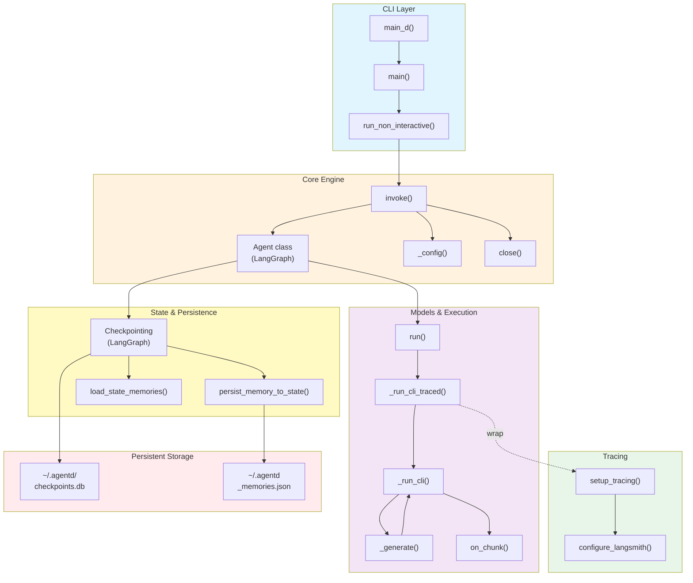

# AgentD Architecture

**Production-grade LLM agent framework with session persistence, memory, and Claude CLI integration.**

- **Stats**: 68 files | 1,779 symbols | 156 core module symbols (93% cohesion) | 34 execution flows
- **Core Model**: LangGraph state graph + checkpoint persistence (SQLite)
- **LLM Backends**: Claude CLI (agentd-cli) + Copilot CLI (copilot-cli) + OpenAI-compatible APIs (Kimi, Xiaomi MiMo)
- **Tools**: Browser, Research, Pentester, Custom Skills
- **Storage**: SQLite checkpoints + In-memory state + JSON memory persistence
- **TUI Integration**: deepagents_cli (Anthropic's framework) with credential management

---

## 1. Core Architecture

### 1.1 High-Level Design

```
┌─────────────────────────────────────────────────────────────┐
│                      User Interface                         │
│                   (deepagents_cli TUI)                      │
│                  /model, /auth, /threads                    │
└──────────────────────┬──────────────────────────────────────┘
                       │
         ┌─────────────▼──────────────────┐
         │      Agent Class               │
         │  (agentd/core.py)              │
         │  - invoke()                    │
         │  - stream()                    │
         │  - get_state()                 │
         │  - get_history()               │
         └──────────────┬──────────────────┘
                        │
         ┌──────────────▼────────────────────────┐
         │     LangGraph StateGraph              │
         │     (agentd/graph.py)                 │
         │  ┌────────────────────────────────┐  │
         │  │  Node: llm_node                │  │
         │  │  - Loads thread memories      │  │
         │  │  - Calls AgentDModel.invoke() │  │
         │  │  - Returns AIMessage          │  │
         │  └────────────────────────────────┘  │
         └──────────────┬───────────────────────┘
                        │
         ┌──────────────┴──────────────────────┐
         │                                      │
    ┌────▼─────────────┐            ┌──────────▼──────┐
    │  Persistence     │            │  Memory System  │
    │  (agentd/)       │            │  (agentd/)      │
    ├──────────────────┤            ├─────────────────┤
    │ - Checkpointer   │            │ - Thread mems   │
    │   (SQLite)       │            │ - User facts    │
    │ - Store          │            │ - JSON fallback │
    │   (InMemory)     │            │ - LangSmith     │
    └──────────────────┘            └─────────────────┘
```

### 1.2 Execution Flow

**User message → Agent.invoke() → Graph.invoke() → LLM node → AgentDModel._run_cli() → Claude binary → Response**

1. **User types message** in deepagents TUI
2. **Agent.invoke(message, thread_id)** constructs HumanMessage + config
3. **build_graph()** StateGraph compiles with SqliteSaver + InMemoryStore
4. **llm_node** is the single graph node:
   - Loads `_thread_memories` from state
   - Prepends `SystemMessage(memories_prompt)` to messages
   - Calls `AgentDModel.invoke(messages)`
   - Returns `{"messages": [AIMessage]}`
5. **AgentDModel** shells out to Claude binary via subprocess:
   - `_messages_to_prompt()` serializes LangChain messages
   - `_run_cli()` streams JSONL output with `subprocess.Popen`
   - Parses chunks via selectors; collects into final response
6. **Checkpoint system** persists state after each turn
7. **Response** yielded back to TUI

---

## 2. Core Modules

### 2.1 `agentd/core.py` — Agent Class

**Entry point for all agent operations.**

| Method | Purpose |
|--------|---------|
| `__init__(model, db_path, checkpointer, store)` | Initialize graph + checkpointer + store |
| `invoke(message, thread_id)` | Send message, get final state dict |
| `stream(message, thread_id)` | Yield state updates as they happen |
| `get_state(thread_id)` | Return current StateSnapshot |
| `get_history(thread_id, limit)` | Yield checkpoint snapshots (newest first) |
| `update_state(thread_id, values)` | Write values directly to checkpoint |
| `close()` | Close SQLite connection |

**Key design**: Agent owns a single CompiledStateGraph (built once in `__init__`). Graph invokes with `config={"configurable": {"thread_id": thread_id}}` for multi-thread isolation.

### 2.2 `agentd/graph.py` — StateGraph Definition

**Single-node LangGraph with memory injection.**

```python
class AgentState(MessagesState):
    """Extends LangChain MessagesState with thread-scoped memories."""
    _thread_memories: list[str]
```

| Function | Purpose |
|----------|---------|
| `_make_llm_node(model_name)` | Factory: returns `llm_node(state) → dict` |
| `build_graph(model_name, checkpointer, store)` | Compile graph with checkpoint + store |

**Memory injection**: Before calling model, `llm_node` prepends memories as SystemMessage:

```python
memories_prompt = get_memories_prompt(thread_memories=thread_memories)
if memories_prompt:
    messages = [SystemMessage(content=memories_prompt)] + messages
```

### 2.3 `agentd/models.py` — LLM Models

**Bridges LangChain BaseChatModel with external LLM binaries.**

#### AgentDModel (Claude CLI)

| Method | Purpose |
|--------|---------|
| `__init__(model, cli_binary, ...)` | Locate `claude` binary (or `/root/.local/bin/claude`) |
| `_messages_to_prompt(messages)` | Serialize LangChain messages to text prompt |
| `_make_cli_command(...)` | Build `claude` subprocess args |
| `_run_cli(cmd, on_chunk)` | Popen + select-based streaming; parse JSONL chunks |
| `invoke(input, ...)` | Sync call: run CLI, collect response |
| `stream(input, ...)` | Yield ChatGenerationChunk as CLI streams |

**JSONL Format**: Claude binary outputs `{"type": "text", "text": "..."}` or `{"type": "tool_use", ...}` per line.

#### CopilotModel

Similar to AgentDModel but shells out to `copilot` binary with Copilot CLI's JSONL format.

**Provider Registry** (lines 43–49 in models.py):

```python
KIMI_PROVIDER = "kimi"
KIMI_DEFAULT_MODEL = "moonshot-v1-8k"
XIOMIMIMO_PROVIDER = "xiomimimo"
XIOMIMIMO_DEFAULT_MODEL = "mimo-7b-rl"
```

Registered with `register_model()` so TUI/clients discover them via `agentd.model_registry.get_models()`.

### 2.4 `agentd/persistence.py` — Checkpointing & Store

**SQLite-backed session persistence + cross-thread memory.**

| Function | Purpose |
|----------|---------|
| `make_checkpointer(db_path)` | Context manager: yield SqliteSaver |
| `make_store()` | Return InMemoryStore for cross-thread facts |

**Storage Paths**:
- Checkpoints: `~/.agentd/checkpoints.db` (SQLite)
- Memories: `~/.agentd_memories.json` (user-scoped facts)
- Research: `~/.agentd/research/knowledge_graph.json` (research tool state)

### 2.5 `agentd/memory.py` — Memory System

**Two-tier persistent memory: thread-scoped + user-scoped.**

| Function | Purpose |
|--------|---------|
| `load_memories()` | Load all user facts from JSON |
| `save_memories(list)` | Persist facts to disk |
| `add_memory(fact)` | Append + save |
| `get_memories_prompt(thread_memories)` | Format memories for system prompt |
| `persist_memory_to_state(agent, fact, thread_id)` | Write to graph state |
| `load_state_memories(state)` | Extract memories from checkpoint |

**User memories** (global, across all threads): `~/.agentd_memories.json`
```json
[
  {"fact": "...", "created": "2026-05-14T..."},
  ...
]
```

### 2.6 `agentd/research_tools.py` — Data Gathering & Storage

**Tools for deep research: browsing, web search, content extraction, knowledge graphs.**

| Class/Function | Purpose |
|---|---|
| `ResearchTools` | Knowledge graph builder + browser toolkit wrapper |
| `browse_url(url)` | Fetch & extract content |
| `search_web(query)` | Web search (via deepagents_cli) |
| `process_markdown(content)` | Parse markdown → structured data |
| `structure_findings(findings)` | Organize + summarize findings |
| `create_graph_node(topic, details)` | Add node to knowledge graph |
| `link_nodes(source, target, relationship)` | Create graph edges |

**Storage**: Knowledge graphs → `~/.agentd/research/knowledge_graph.json`

### 2.7 `agentd/pentester_skill.py` — Offensive Security Tools

**Pentester skill library + threat research tools.**

| Function | Purpose |
|---|---|
| `threat_research(query)` | Search threat intelligence sources |
| `retrieve_from_library(category)` | Fetch pentester skill from library |
| `list_skill_library()` | List available pentester skills |
| `handle_pentester_skill(skill_name)` | Execute named skill |

**Integrated with LangSmith** for observability.

### 2.8 `agentd/tracing.py` — LangSmith Integration

**Automatic observability: token tracking, execution traces, debugging.**

| Function | Purpose |
|---|---|
| `configure_langsmith()` | Initialize LangSmith client |
| `create_anthropic_client()` | Create Anthropic SDK client with API key |
| `trace_run(run_name, ...)` | Decorator: trace a function in LangSmith |
| `traceable` | Re-export LangSmith's @traceable decorator |

**Auto-enabled** if `LANGSMITH_API_KEY` is set.

### 2.9 `agentd/browser_tools.py` — Browser Automation

**Headless browser kit for interactive web research.**

| Method | Purpose |
|---|---|
| `get_browser_status()` | Check if browser is running |
| `BrowserToolkit.fetch_page(url, selector)` | Navigate + extract DOM |
| `BrowserToolkit.run_js(script)` | Execute JavaScript in page context |

**Uses playwright** under the hood.

---

## 3. Functional Areas (Clusters)

### 3.1 Agentd (156 symbols, 93% cohesion)

**Core agent engine, model bindings, and tool integrations.**

Key members:
- `Agent` (core.py) — main entry point
- `AgentDModel`, `CopilotModel` (models.py) — LLM wrappers
- `AgentState`, `build_graph` (graph.py) — LangGraph definition
- `persist_memory_to_state`, `load_state_memories` (memory.py)
- `ResearchTools`, `get_research_tools` (research_tools.py)
- `PentesterSkill`, `threat_research` (pentester_skill.py)
- `BrowserToolkit` (browser_tools.py)

### 3.2 Tests (53 symbols, 89% cohesion)

**Unit tests for persistence, memory, graph, and CLI integration.**

Key test files:
- `tests/test_persistence.py` — checkpointer + store tests
- `tests/test_memory.py` — memory load/save + state persistence
- `tests/test_core.py` — Agent.invoke/stream/get_state tests
- `tests/test_models.py` — AgentDModel._run_cli tests

### 3.3 Examples (18 symbols, 84% cohesion)

**Example scripts demonstrating AgentD patterns.**

Key examples:
- `examples/agent_with_tools.py` — Basic Agent + tools usage
- `examples/decorator_tracing.py` — @traceable decorator + LangSmith
- `examples/anthropic_client.py` — Direct Anthropic SDK usage

---

## 4. Key Execution Flows

### Flow 1: Basic Conversation Turn

**Verified trace from GitNexus (Main_d → _config):**
```
main_d (agentd/cli.py)
  ↓
main (agentd/cli.py)
  ↓
run_non_interactive (agentd/cli.py)
  ↓
invoke (agentd/core.py)
  ↓
_config (agentd/core.py)
```

**Detail**:
```
User input (TUI)
  ↓
Agent.invoke(message, thread_id="user-123")
  ↓
build_graph().invoke(
  {"messages": [HumanMessage(content=message)]},
  config={"configurable": {"thread_id": "user-123"}}
)
  ↓
llm_node(state):
  - Load _thread_memories from checkpoint
  - Prepend SystemMessage(memories)
  - Call AgentDModel.invoke(messages)
  ↓
AgentDModel._run_cli():
  - _messages_to_prompt(messages) → text prompt
  - subprocess.Popen(["claude", "--prompt", prompt])
  - Select-based streaming on stdout/stderr
  - Parse JSONL chunks → collect AIMessage
  ↓
Return AIMessage to graph
  ↓
SqliteSaver checkpoint: save state + thread_id
  ↓
Response yielded to TUI
```

### Flow 2: Cleanup & Resource Management

**Verified trace from GitNexus (Main_d → Close):**
```
main_d (agentd/cli.py)
  ↓
main (agentd/cli.py)
  ↓
run_non_interactive (agentd/cli.py)
  ↓
close (agentd/core.py)
```

Handles graceful shutdown and SQLite connection cleanup after execution completes.

### Flow 3: Streaming Execution & Output

**Verified trace from GitNexus (Run → On_chunk):**
```
run (agentd/models.py)
  ↓
_run_cli_traced (agentd/models.py)
  ↓
_run_cli (agentd/models.py)
  ↓
on_chunk (agentd/models.py)
```

Executes agent logic with tracing enabled, streaming responses in chunks for real-time feedback.

**Verified trace from GitNexus (_generate → On_chunk):**
```
_generate (agentd/models.py)
  ↓
_run_cli_traced (agentd/models.py)
  ↓
_run_cli (agentd/models.py)
  ↓
on_chunk (agentd/models.py)
```

Generates responses from agent state and streams them via the chunk handler.

### Flow 4: Tracing & Observability Setup

**Verified trace from GitNexus (Example_decorator_tracing → Configure_langsmith):**
```
example_decorator_tracing (examples/tracing_example.py)
  ↓
setup_tracing (examples/tracing_example.py)
  ↓
configure_langsmith (agentd/tracing.py)
```

Demonstrates proper LangSmith initialization for production observability and token tracking.

### Flow 5: Memory Persistence (User-Scoped)

```
User: /remember I prefer concise responses
  ↓
TUI calls add_memory("I prefer concise responses")
  ↓
Load ~/.agentd_memories.json
Append {"fact": "...", "created": "..."}
Save back to disk
  ↓
Next Agent.invoke() on same OR different thread:
  - load_memories() → list of facts
  - get_memories_prompt(facts) → formatted SystemMessage
  - Injected before model.invoke()
```

---

## 5. Integration with deepagents_cli TUI

AgentD is **not** the TUI itself. It provides:

1. **Core Agent class** — LangChain integration point
2. **Model providers** — agentd-cli, copilot-cli, kimi, xiomimimo (registered in models.py)
3. **Checkpoint backend** — SQLite for multi-turn state
4. **Tools** — Research, Pentester, Browser (available to TUI as skills)

**deepagents_cli** provides:
- Terminal UI (interactive slash commands like `/model`, `/auth`, `/threads`)
- Model selector with auto-discovery (`/model` switcher)
- Credential manager (`/auth` → stores keys in `~/.deepagents/.state/auth.json`)
- Tool discovery & skill registry
- LangSmith integration

**Connection**: 
- TUI reads model list from `agentd.model_registry.get_models()` (bytecode-only)
- TUI instantiates Agent(model="sonnet") when needed
- Agent calls AgentDModel, which calls claude binary
- Checkpoints saved to SQLite, accessible via Agent.get_history()

---

## 6. Provider Registration (Updated)

**As of latest changes**, the following providers are registered:

| Provider | Model(s) | Backend | API Key Env | Base URL |
|----------|----------|---------|-------------|----------|
| agentd-cli | sonnet, haiku, opus | Claude CLI subprocess | N/A | N/A |
| copilot-cli | copilot | Copilot CLI subprocess | N/A | N/A |
| kimi | moonshot-v1-8k, -32k, -128k | OpenAI-compatible API | MOONSHOT_API_KEY | https://api.moonshot.cn/v1 |
| xiomimimo | mimo-7b-rl, mimo-7b-sft | Ollama or Xiaomi API | (TBD) | (TBD) |

**Configuration files**:
- `agentd/models.py` — Provider constants + register_model() calls
- `~/.deepagents/config.toml` — TUI model provider entries (`[models.providers.kimi]`, etc.)
- `~/.deepagents/.state/auth.json` — Stored API keys (file mode 0600)

---

## 7. Data Flow Diagram (GitNexus Verified)



**Legacy ASCII diagram** (kept for reference):
```
┌──────────────────────────────────────┐
│         deepagents_cli TUI           │
│  • /model selector                   │
│  • /auth credential manager          │
│  • /threads history browser          │
└────────────┬────────────────────────┘
             │
             ↓
        ┌─────────────────┐
        │  Agent(model)   │◄────────┐
        │  (core.py)      │         │
        └────────┬────────┘         │
                 │                  │
         ┌───────▼──────────┐       │
         │  LangGraph State │       │
         │  (graph.py)      │       │
         │  • AgentState    │       │
         │  • llm_node      │       │
         └────────┬─────────┘       │
                  │                 │
      ┌───────────▼──────────┐      │
      │   AgentDModel        │      │
      │   (models.py)        │      │
      │   • _run_cli()       │      │
      └───────────┬──────────┘      │
                  │                 │
              ┌───▼────┐            │
              │ Claude │            │
              │ binary │            │
              └────────┘            │
                  │                 │
         ┌────────▼─────────┐       │
         │   Response       │       │
         │   (AIMessage)    │       │
         └────────┬─────────┘       │
                  │                 │
         ┌────────▼──────────┐      │
         │ SqliteSaver       │◄─────┤
         │ (persistence.py)  │      │
         │ Save checkpoint   │      │
         └────────┬──────────┘      │
                  │                 │
              ┌───▼────────────┐    │
              │ ~/.agentd/     │    │
              │ checkpoints.db │    │
              └────────────────┘    │
                                    │
          ┌──────────────────────────┘
          │  (state recovery)
          │
   ┌──────▼──────────────┐
   │  Agent.get_history()│
   │  Agent.get_state()  │
   └─────────────────────┘
```

---

## 8. Module Dependencies

```
Core:
  agentd/core.py
    ├─ agentd/graph.py
    ├─ agentd/models.py (AgentDModel, CopilotModel)
    ├─ agentd/persistence.py (make_checkpointer, make_store)
    └─ agentd/memory.py (get_memories_prompt)

Graph:
  agentd/graph.py
    ├─ agentd/models.py (AgentDModel)
    └─ agentd/memory.py (get_memories_prompt)

Models:
  agentd/models.py
    ├─ langchain_core.BaseChatModel
    ├─ langsmith.@traceable (optional)
    └─ agentd/model_registry.register_model (optional)

Memory:
  agentd/memory.py
    ├─ langgraph.store.base (cross-thread persistence)
    └─ ~/.agentd_memories.json (user-scoped facts)

Tools:
  agentd/research_tools.py
    ├─ agentd/browser_tools.py
    └─ ~/.agentd/research/knowledge_graph.json

  agentd/pentester_skill.py
    ├─ agentd/research_tools.py
    └─ agentd/tracing.py (@traceable)

LangSmith:
  agentd/tracing.py
    └─ langsmith (optional, env-gated)

TUI Integration:
  deepagents_cli (external package)
    ├─ agentd.model_registry.get_models() (provider discovery)
    ├─ agentd/models.py (AgentDModel instantiation)
    ├─ agentd/persistence.py (checkpoint retrieval)
    └─ agentd/auth_store.py (credential storage)
```

---

## 9. Testing Architecture

**Test framework**: pytest + fixtures

| Test Module | Coverage |
|---|---|
| test_core.py | Agent.invoke, stream, get_state, get_history |
| test_persistence.py | SqliteSaver, InMemoryStore, checkpoint round-trip |
| test_memory.py | Memory load/save, state persistence, async |
| test_models.py | AgentDModel._run_cli, message serialization |

**Key test patterns**:
- In-memory SQLiteSaver for fast tests
- Fixture-based Agent setup
- Mock subprocess for CLI tests
- Async test support (test_memory.py)

---

## 10. Deployment & Configuration

### Environment Variables

| Variable | Purpose | Default |
|----------|---------|---------|
| `LANGSMITH_API_KEY` | Enable LangSmith tracing | (unset = disabled) |
| `LANGSMITH_PROJECT` | LangSmith project name | "default" |
| `MOONSHOT_API_KEY` | Kimi/Moonshot AI authentication | (required for kimi provider) |
| `CLAUDE_CLI_BINARY` | Path to claude binary | Auto-detect |

### File Paths

| Path | Purpose | Permissions |
|---|---|---|
| `~/.agentd/checkpoints.db` | SQLite checkpoint store | User readable |
| `~/.agentd_memories.json` | Global user memories | User readable |
| `~/.agentd/research/knowledge_graph.json` | Research tool graphs | User readable |
| `~/.deepagents/.state/auth.json` | TUI credential store | 0600 (secure) |
| `~/.deepagents/config.toml` | TUI provider config | User readable |

### Quick Start

```bash
# Install agentd
pip install -e /root/agentD

# Use in Python
from agentd import Agent
agent = Agent(model="sonnet")
result = agent.invoke("Hello, world!", thread_id="default")
print(result["messages"][-1].content)

# Use in deepagents TUI
D  # Quick shortcut (auto-approve + full TUI)
# Or: deepagents -M claude-cli -S all -y

# Set Kimi API key
export MOONSHOT_API_KEY="sk-..."
# Then in TUI: /model → select "Kimi 8k"
```

---

## 11. Future Extensions

**Planned enhancements**:
1. Custom node types (tool calling, parallel branches)
2. Vector database integration (for retrieval-augmented generation)
3. Multi-agent orchestration (sequential/parallel node execution)
4. Streaming memory updates (SSE instead of JSON polling)
5. Xiaomi MiMo cloud API integration (when available)

---

---

## Appendix: GitNexus Analysis

This architecture document was enhanced with execution traces from **GitNexus**, a code intelligence tool that analyzes the knowledge graph of this codebase.

**Index Statistics** (as of 2026-05-14):
- **Files**: 68
- **Symbols**: 1,779
- **Execution Flows**: 34
- **Functional Areas**: 3 (Agentd, Tests, Examples)

**Key Execution Flows Verified**:
1. `Main_d → _config` (5 steps, cross-community) — CLI initialization
2. `Run → On_chunk` (4 steps, intra-community) — streaming execution
3. `_generate → On_chunk` (4 steps, cross-community) — response generation
4. `Main_d → Close` (4 steps, cross-community) — cleanup
5. `Example_decorator_tracing → Configure_langsmith` (3 steps, cross-community) — tracing setup

**Available Resources**:
- `gitnexus://repo/agentD/context` — Codebase overview
- `gitnexus://repo/agentD/clusters` — Functional areas
- `gitnexus://repo/agentD/processes` — All execution flows
- `gitnexus://repo/agentD/process/{name}` — Step-by-step trace

**To refresh this analysis**, run: `npx gitnexus analyze` and then regenerate with `/mcp__gitnexus__generate_map agentD`

---

**Generated**: 2026-05-14  
**Version**: agentd 0.1.0  
**Analysis Tool**: GitNexus v1.0
